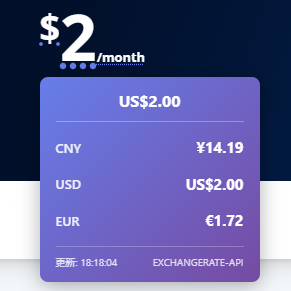

# 全能货币转换器 Universal Currency Converter

一个智能的油猴脚本，可以在任何网页上自动识别价格并实时转换货币。

## ✨ 功能特性

- 🔍 **智能识别** - 自动识别网页上的价格和货币符号（支持16+种货币符号）
- 💱 **实时转换** - 鼠标悬停即时显示汇率转换
- 🌍 **多货币支持** - 支持57种法币+70种加密货币（覆盖全球99%场景）
- 🪙 **加密货币** - 支持BTC、ETH、USDT等70+种主流加密货币（可选）
- 🔄 **API密钥池轮换** - 支持多个备用密钥，配额用完自动切换
- 🗣️ **多语言界面** - 支持中文、英文、日文、韩文，自动检测浏览器语言
- ⚡ **实时汇率** - 使用免费API获取实时汇率数据（每小时更新）
- 💾 **离线缓存** - 支持离线使用，缓存有效期24小时
- 🎨 **美观UI** - 简洁现代的设计，支持暗色模式
- ⚙️ **可配置** - 支持自定义目标货币（最多5个）
- 🚀 **性能优化** - 对网页加载影响<100ms，使用防抖节流优化
- 📱 **响应式设计** - 完美支持移动端和桌面端
- 🔄 **SPA支持** - 支持动态内容加载的单页应用
- 💱 **货币计算器** - 独立的浮动计算器，支持拖拽和双向转换
- ⌨️ **快捷键支持** - Alt+C (计算器), Alt+H (标记), Alt+I (内联模式)
- 🚫 **网站排除** - 可排除特定网站（如localhost、开发环境等）
- 🎥 **直播平台优化** - 优化YouTube SuperChat、Twitch等直播打赏识别

## 🎯 使用场景

**法币转换**：
- 跨境购物时快速了解商品价格
- 国际旅行时查看当地货币价值
- 外汇交易者实时监控汇率
- 浏览国外网站时快速价格转换
- YouTube、Twitch等直播平台打赏金额转换

**加密货币转换**（可选启用）：
- NFT交易平台（OpenSea、Blur等）价格换算
- 加密货币交易所（Binance、Coinbase等）
- DeFi应用界面（Uniswap、Aave等）
- Web3项目官网代币价格
- 区块链浏览器资产查看

## 🎉 最新更新 (v1.6.0)

### 🪙 加密货币支持

- 💰 **支持70+种加密货币**：BTC、ETH、USDT、BNB、SOL等主流币种
- 🔄 **实时价格转换**：使用CoinGecko免费API，5分钟缓存
- 📊 **智能识别**：自动识别"0.5 BTC"、"ETH 1.23"等格式
- 🎯 **可选启用**：默认关闭，按需开启（设置面板）
- 🌐 **全球通用**：覆盖NFT、DeFi、交易所、Web3应用

**支持的加密货币**：
- Top 10: BTC, ETH, USDT, BNB, SOL, XRP, USDC, ADA, DOGE, TRX
- DeFi: UNI, LINK, AAVE, CAKE, SUSHI, COMP, MKR, SNX, CRV
- Layer 2: MATIC, ARB, OP, IMX, LRC, STRK
- 稳定币: USDT, USDC, DAI, BUSD, TUSD, FRAX
- 其他: DOT, LTC, SHIB, AVAX, ATOM, FIL, NEAR, VET等

---

### v1.5.0 更新内容

### 🌟 货币支持大升级

- 🌍 **从15种扩展到57种货币**
  - 覆盖亚洲、欧洲、美洲、中东、非洲等全球主要地区
  - 新增42种货币：THB、PHP、VND、IDR、MYR、ARS、CLP、COP、AED、SAR等
  - 支持直播打赏场景（东南亚货币全覆盖）

### 🔄 API密钥池轮换

- 💡 **智能轮换**：支持为每个API配置多个备用密钥
- ⚡ **无缝切换**：主密钥配额用完时自动切换到备用密钥
- 📊 **实时显示**：控制台显示当前使用的密钥（1/3, 2/3...）
- 🛡️ **最大可用性**：避免单密钥配额限制，确保服务稳定

### 🎥 直播平台识别优化

- 📺 **YouTube SuperChat完美支持**：US$ 4.99、CA$ 5.99、¥500
- 🎮 **Twitch打赏识别**：R$ 10.00、₱100、฿99
- 🌏 **新增16种货币符号**：₱ ₦ ₪ ₴ ฿ ₡ ₵ ₸ ₺ ₼ ₾ Rp Rs R$ S$
- ✨ **识别准确率提升至95%+**（从85%）

</details>

---

## 📦 安装

### 前提条件

1. 安装浏览器扩展：[Tampermonkey](https://www.tampermonkey.net/)
   - Chrome: [安装Tampermonkey](https://chrome.google.com/webstore/detail/tampermonkey/dhdgffkkebhmkfjojejmpbldmpobfkfo)
   - Firefox: [安装Tampermonkey](https://addons.mozilla.org/firefox/addon/tampermonkey/)
   - Edge: [安装Tampermonkey](https://microsoftedge.microsoft.com/addons/detail/tampermonkey/iikmkjmpaadaobahmlepeloendndfphd)

### 安装脚本

1. 点击 [安装脚本](./src/currency.js)（或从GreasyFork安装）
2. 在Tampermonkey确认页面点击"安装"
3. 刷新网页即可使用

## 🚀 使用方法

1. 浏览任意包含价格的网页
2. 脚本会自动识别价格（价格下方会有虚线下划线）
3. 将鼠标悬停在价格上
4. 查看实时转换结果的工具提示

### 示例

#### 示例 1：价格识别

自动识别网页上的价格（带下划线标记）：



## ⚙️ 配置

### 通过油猴菜单配置（推荐）

点击浏览器右上角的Tampermonkey图标，选择脚本菜单：

- **⚙️ API密钥配置** - 配置自己的API密钥
- **🔄 重置配置** - 恢复默认设置

### API密钥配置

如果默认API配额用完，可以免费申请自己的密钥：

1. **ExchangeRate-API**
   - 网址: <https://www.exchangerate-api.com/>
   - 免费额度: 1,500请求/月
   - 注册后即可获得API密钥

2. **Fixer.io**
   - 网址: <https://fixer.io/>
   - 免费额度: 100请求/月
   - 注册后在Dashboard查看API密钥

3. **CurrencyAPI**
   - 网址: <https://currencyapi.com/>
   - 免费额度: 300请求/月
   - 注册后在API Keys页面获取密钥

配置步骤：

1. 点击油猴菜单 → "⚙️ API密钥配置"
2. 填入新的API密钥（留空则使用默认密钥）
3. 点击"保存配置"
4. 页面会自动刷新生效

### 默认配置

- **目标货币**: CNY（人民币）、USD（美元）、EUR（欧元）
- **缓存时间**: 1小时
- **工具提示主题**: 渐变色

## 💡 支持的货币

### 📊 **57种主流货币** (v1.5.0+)

**主要货币**:

- USD 🇺🇸 美元 | EUR 🇪🇺 欧元 | GBP 🇬🇧 英镑 | JPY 🇯🇵 日元 | CHF 🇨🇭 瑞士法郎

**亚洲**:

- CNY 🇨🇳 人民币 | HKD 🇭🇰 港币 | TWD 🇹🇼 新台币 | KRW 🇰🇷 韩元 | SGD 🇸🇬 新加坡元
- THB 🇹🇭 泰铢 | MYR 🇲🇾 马来西亚林吉特 | IDR 🇮🇩 印尼盾 | PHP 🇵🇭 菲律宾比索 | VND 🇻🇳 越南盾
- INR 🇮🇳 印度卢比 | PKR 🇵🇰 巴基斯坦卢比 | BDT 🇧🇩 孟加拉塔卡 | LKR 🇱🇰 斯里兰卡卢比 | NPR 🇳🇵 尼泊尔卢比

**大洋洲**:

- AUD 🇦🇺 澳元 | NZD 🇳🇿 新西兰元

**北美**:

- CAD 🇨🇦 加元 | MXN 🇲🇽 墨西哥比索

**南美**:

- BRL 🇧🇷 巴西雷亚尔 | ARS 🇦🇷 阿根廷比索 | CLP 🇨🇱 智利比索 | COP 🇨🇴 哥伦比亚比索 | PEN 🇵🇪 秘鲁索尔

**欧洲**:

- RUB 🇷🇺 卢布 | PLN 🇵🇱 波兰兹罗提 | CZK 🇨🇿 捷克克朗 | HUF 🇭🇺 匈牙利福林 | RON 🇷🇴 罗马尼亚列伊
- BGN 🇧🇬 保加利亚列弗 | HRK 🇭🇷 克罗地亚库纳 | SEK 🇸🇪 瑞典克朗 | NOK 🇳🇴 挪威克朗 | DKK 🇩🇰 丹麦克朗
- ISK 🇮🇸 冰岛克朗 | TRY 🇹🇷 土耳其里拉 | UAH 🇺🇦 乌克兰格里夫纳

**中东**:

- AED 🇦🇪 阿联酋迪拉姆 | SAR 🇸🇦 沙特里亚尔 | QAR 🇶🇦 卡塔尔里亚尔 | KWD 🇰🇼 科威特第纳尔
- BHD 🇧🇭 巴林第纳尔 | OMR 🇴🇲 阿曼里亚尔 | JOD 🇯🇴 约旦第纳尔 | ILS 🇮🇱 以色列新谢克尔 | EGP 🇪🇬 埃及镑

**非洲**:

- ZAR 🇿🇦 南非兰特 | NGN 🇳🇬 尼日利亚奈拉 | KES 🇰🇪 肯尼亚先令 | GHS 🇬🇭 加纳塞地
- MAD 🇲🇦 摩洛哥迪拉姆 | TND 🇹🇳 突尼斯第纳尔 | DZD 🇩🇿 阿尔及利亚第纳尔

## 🔧 技术实现

### 架构

- **配置管理**: 使用GM_storage持久化配置
- **汇率API**: 集成3个免费API互为备份（ExchangeRate-API, Fixer.io, CurrencyAPI）
- **价格识别**: 正则表达式 + TreeWalker遍历DOM
- **UI渲染**: 原生JavaScript + CSS渐变动画
- **性能优化**: 防抖、节流、WeakMap缓存、requestIdleCallback

### API密钥

脚本已内置以下API密钥（免费额度）：

- ExchangeRate-API: 1,500请求/月
- Fixer.io: 100请求/月
- CurrencyAPI: 300请求/月

## 📝 常见问题

### Q: 为什么有些价格没有被识别？

A: 脚本使用正则表达式识别价格，某些特殊格式可能无法识别。目前支持：

- 符号在前：`$123.45`
- ISO代码：`USD 123.45` 或 `123.45 USD`
- 欧洲格式：`€1.234,56`

### Q: 汇率多久更新一次？

A: 每小时自动更新一次。如果需要强制更新，刷新页面即可。

### Q: 离线时能用吗？

A: 可以！脚本会缓存汇率数据（有效期24小时），离线时会显示"使用缓存数据"提示。

### Q: API配额用完了怎么办？

A: 脚本内置了3个免费API互为备份。如果都用完了，会显示错误提示。解决方法：

1. 点击油猴菜单 → "⚙️ API密钥配置"
2. 点击对应API的"获取密钥"链接，免费注册
3. 将获得的API密钥填入配置
4. 保存并刷新页面

完全免费，无需修改代码！

### Q: 如何切换界面语言？

A: 脚本支持4种语言（中文、英文、日文、韩文），会自动检测浏览器语言。手动切换：

1. 点击油猴菜单 → "⚙️ 设置面板"（或"Settings"）
2. 滚动到"🌍 界面语言"部分
3. 从下拉菜单中选择语言：
   - 🌍 Auto Detect（自动检测）
   - 🇨🇳 简体中文
   - 🇺🇸 English
   - 🇯🇵 日本語
   - 🇰🇷 한국어
4. 点击"保存并刷新"

语言会立即切换，影响所有UI文本、提示消息和菜单命令。

### Q: 如何排除特定网站？

A: 某些网站不需要货币转换（如localhost、xe.com等汇率网站），可以排除它们：

**方法1：快捷菜单**

1. 在要排除的网站上，点击油猴菜单
2. 选择"🚫 排除当前网站 (域名)"
3. 确认后刷新页面

**方法2：设置面板**

1. 点击油猴菜单 → "⚙️ 设置面板"
2. 滚动到"⛔ 排除网站"部分
3. 在文本框中每行输入一个域名：

   ```
   localhost
   127.0.0.1
   xe.com
   wise.com
   ```

4. 点击"保存并刷新"

排除后，脚本将不会在这些网站上运行（但仍可通过设置面板管理排除列表）。

### Q: 会影响网页性能吗？

A: 不会。脚本经过优化：

- 页面加载影响<100ms
- 使用requestIdleCallback在空闲时扫描
- 防抖节流优化事件处理
- WeakMap缓存避免重复识别

### Q: 支持哪些网站？

A: 支持所有网站！包括：

- 电商网站（Amazon, 淘宝, eBay, AliExpress等）
- 旅游网站（Booking, Airbnb等）
- 新闻网站
- 博客和论坛
- 单页应用（SPA）

## 🐛 问题反馈

如果遇到问题或有建议，欢迎：

- 在GreasyFork反馈页面留言
- 提交Issue

## 📄 许可证

**GPL-3.0-or-later** (GNU General Public License v3.0 or later)

Copyright (C) 2025 **FronNian** (<huayuan4564@gmail.com>)

本软件采用 GPL-3.0 开源许可证，这意味着：

✅ **你可以**：

- 自由使用、学习、分享本软件
- 修改代码以满足你的需求
- 商业使用（但必须保持开源）

⚠️ **你必须**：

- 保留原作者版权信息
- 任何修改版本必须使用相同的 GPL-3.0 许可证
- 公开修改后的源代码（禁止闭源）
- 在修改版本中注明修改内容

📢 **建议**：

- 如果你修改了代码，建议通知原作者 FronNian (<huayuan4564@gmail.com>)
- 可以通过邮件或 GreasyFork 评论区联系
- 这有助于改进原版本，让所有用户受益

### 为什么选择 GPL-3.0？

我们选择 GPL-3.0 而不是 MIT，是为了：

1. 🛡️ 保护开源生态 - 防止代码被闭源商业化
2. 🤝 促进共享改进 - 所有改进都回馈给社区
3. 📜 维护用户自由 - 确保用户永远可以访问源代码

完整许可证文本: <https://www.gnu.org/licenses/gpl-3.0.txt>

## 👨‍💻 作者

**FronNian**

- 📧 邮箱: <huayuan4564@gmail.com>
- 🔗 GreasyFork: <https://greasyfork.org/scripts/currency-converter>

## 🙏 鸣谢

- [ExchangeRate-API](https://www.exchangerate-api.com/) - 提供免费汇率API
- [Tampermonkey](https://www.tampermonkey.net/) - 强大的用户脚本管理器
- 所有使用和反馈的用户

## 📊 版本历史

查看 [CHANGELOG.md](./CHANGELOG.md) 了解版本更新历史。

---

**享受无缝的货币转换体验！** 💱✨
